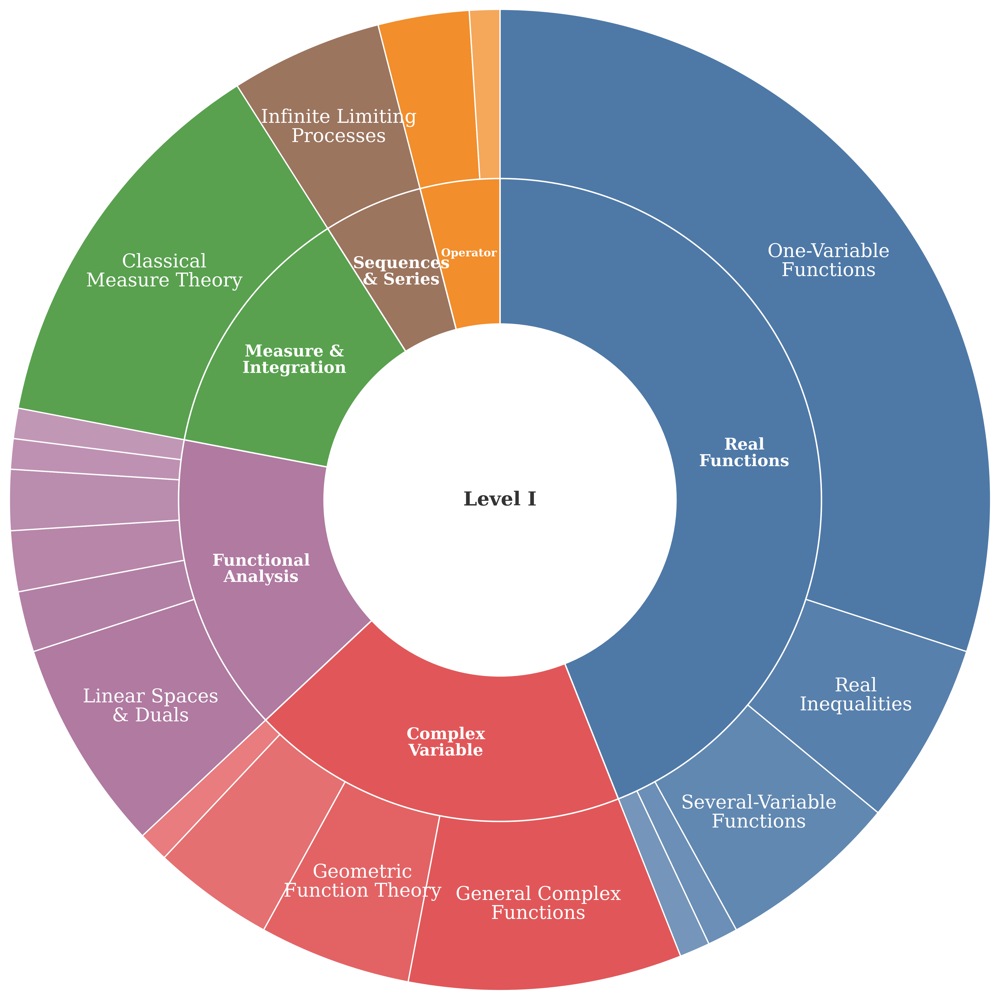
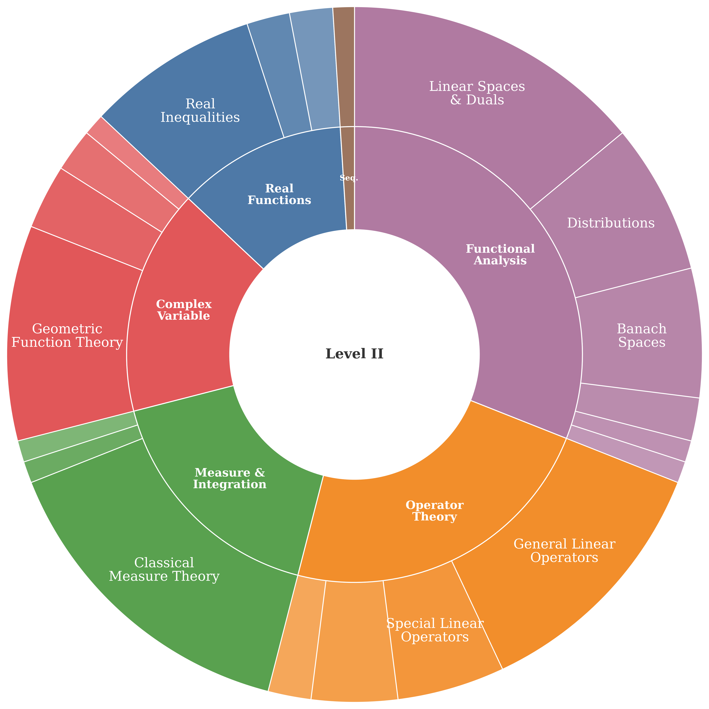
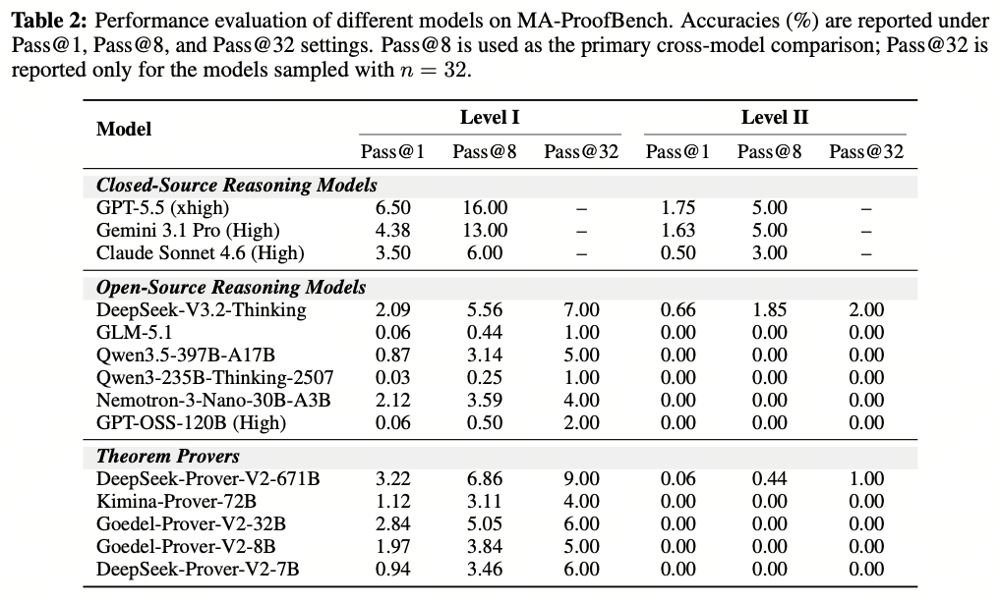

# MA-ProofBench：面向数学分析定理证明的大语言模型双层评测基准

<p align="center">
  <a href="README.md">English</a> | <b>中文</b>
</p>

<p align="center">
  <a href="https://huggingface.co/datasets/openbmb/MA-ProofBench"></a>
  <a href="https://arxiv.org/abs/2606.13782"></a>
</p>

我们提出 **MA-ProofBench**——据我们所知，这是首个用于评测大语言模型（LLM）在**数学分析**定理证明能力的形式化基准。它包含 **200** 道经过严格形式化的定理证明题，基于 [Lean 4](https://leanprover.github.io/)（v4.28.0），并划分为两个难度层级：

| 层级         | 描述   | 来源               | 数量  |
|--------------|--------|--------------------|-------|
| **Level I**  | 本科   | 基础教材习题       | 100   |
| **Level II** | 博士   | 顶尖高校考试题     | 100   |

这些题目覆盖 **6 个核心主题**与 **27 个子类别**，涵盖*测度与积分论*、*复分析*、*泛函分析*等类别。MA-ProofBench 聚焦于以往基准中覆盖不足、且需要对连续性、极限与拓扑结构进行深入推理的领域。每道题均通过「人类专家主导、LLM 辅助」的形式化流程构建，并经过独立专家盲审，以确保数学严谨性。

<p align="center">
  
  
</p>

## 类别分布

题目依据 **数学主题分类（MSC）**方案进行划分：

| 类别                | Level I | Level II |
| ------------------- | ------- | -------- |
| 实函数              | 44      | 12       |
| 泛函分析            | 15      | 31       |
| 复变函数            | 19      | 16       |
| 测度与积分          | 13      | 17       |
| 算子理论            | 4       | 23       |
| 数列、级数与可和性  | 5       | 1        |

## 评测

<p align="center">
  
</p>

`evaluation/` 包通过兼容 OpenAI 的 API 生成证明，并使用 [Kimina Lean Server](https://github.com/project-numina/kimina-lean-server) 进行验证。

首先安装评测所需依赖：

```bash
pip install -r requirements.txt
```

随后配置并启动 Lean server（请确保使用 Lean v4.28.0）：

```bash
cd kimina-lean-server

cp .env.template .env # 可选
bash setup.sh # 安装 Lean、repl 与 mathlib4
pip install -r requirements.txt
pip install .
prisma generate
python -m server
```

在 Lean server 运行的前提下，使用兼容 OpenAI 的 API 端点启动评测脚本：

```bash
EXTERNAL_API_URL=https://your-api/v1/chat/completions \
EXTERNAL_API_KEY=sk-xxx \
EVAL_MODEL_PATH=your-model-name \
NUM_SAMPLES=8 \
EVAL_MAX_TOKENS=32768 \
EVAL_TEMPERATURE=1.0 \
bash evaluation/run.sh
```

如需手动运行单个阶段：

```bash
# 仅推理
EXTERNAL_API_URL=https://your-api/v1/chat/completions \
EXTERNAL_API_KEY=sk-xxx \
python -m evaluation.main --mode infer \
  --model_path "$EVAL_MODEL_PATH" \
  --output_path predictions.jsonl \
  --split level1 level2 --num_samples 8 \
  --eval_max_tokens 32768 --eval_temperature 1.0

# 仅验证
python -m evaluation.main --mode eval \
  --predictions_path predictions.jsonl \
  --output_path results.jsonl \
  --split level1 level2 --num_samples 8
```

## 引用

```bibtex
@article{ma-proofbench,
  title={MA-ProofBench: A Two-Tiered Evaluation of LLMs for Theorem Proving in Mathematical Analysis},
  author={Lushi Pu and Weiming Zhang and Xinheng Xie and Zixuan Fu and Bingxiang He and Hongya Lyu and Xin Li and Jie Zhou and Yudong Wang},
  year={2026},
  eprint={2606.13782},
  archivePrefix={arXiv},
  primaryClass={cs.AI},
  url={https://arxiv.org/abs/2606.13782}, 
}
```

## 许可证

本项目基于 [MIT 许可证](LICENSE) 发布。
